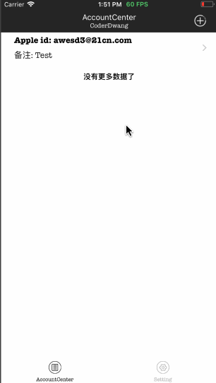

# MoreiTunesConnect_iOS

# 此项目不再更新,有需要可以扫码下载,或者加群: 583946521


# 版本记录&更新日志

- 2018-05-23```v2.0```
    - 修复因苹果更新隐私协议而无法使用的问题

---

- 2018-04-03```v1.6```
    - 新增状态选择，细化操作
    - 移除垃圾代码
    
---

- 2018-03-27```v1.5```
    - 暂时移除全屏返回手势,由于与系统cell的滑动事件存在冲突
    - 移除```关键词&&预览图```右上角编辑按钮，直接摇晃手机即可
    - 为标记为不关注的App增加归属账号标签```(ps:之前设置的App将不会显示归属)```

---

- 2018-03-25 ```v1.4```
    - 使用```私有属性(_isTransitioning)```实现全屏返回功能
    - 为所有控制器增加晃动截图功能

---
    
- 2018-03-24 ```v1.3```
    - 增加屏蔽不需要关注的App(```在App状态查询列表直接对想要隐藏的App左滑即可，在设置中可以使其再次显示```)
    - 为无法显示logo的App设置随机背景色
    - 暂时移除```Today Extension```的使用

---

- 2018-03-22
    - 增加查看当前App关键词、版本更新日志、预览图
    - 预览图大图查看，长按即可分享或保存(使用系统```UIActivityViewController```实现)

---

- 2018-03-18
    - 翻译后的内容可以替换原Cell内容
    - 截取的反馈内容可以直接分享给好友(使用系统```UIActivityViewController```实现)
    
---

- 2018-03-17
    - 查看[苹果](https://idmsa.apple.com/IDMSWebAuth/login?appIdKey=891bd3417a7776362562d2197f89480a8547b108fd934911bcbea0110d07f757&path=%2Faccount%2F&rv=1)反馈信息 
    - [翻译](http://ai.youdao.com)反馈内容(使用```有道智云SDK```实现)
    - 快速复制至粘贴板
    - 截取反馈内容视图
    
----

- 多账号管理
- 随时查看App状态
- 本地信息AES加密
- 粘贴板获取信息，自动录入
- 开源
- 下载代码之后请勿修改版本号，以免无法收到```MoreiTunesConnect_iOS```更新提示
- ios交流群

    
    
- 预览

    


---
#### 如果使用粘贴板自动录入功能，请确保内容格式如下
    {账号/密码/备注>账号/密码/备注>账号/密码/备注}
    或
    {账号/密码>账号/密码>账号/密码}
    或
    {账号/密码/备注>账号/密码>账号/密码/备注}

---

- 第三方
    - [QMUIKit](https://github.com/QMUI/QMUI_iOS)
    - [YTKKeyValueStore](https://github.com/yuantiku/YTKKeyValueStore)
    - [YYCategories](https://github.com/ibireme/YYCategories)
    - [YYModel](https://github.com/ibireme/YYModel)
    - [YYWebImage](https://github.com/ibireme/YYWebImage)
    - [MJRefresh](https://github.com/CoderMJLee/MJRefresh)
    - [IQKeyboardManager](https://github.com/hackiftekhar/IQKeyboardManager)
    - [Masonry](https://github.com/SnapKit/Masonry)
    - [DWCategoryKit](https://github.com/CoderDwang/DWCategoryKit)
    - [DWNetworking](https://github.com/CoderDwang/DWNetworking)
    - [ISMessages](https://github.com/ilyainyushin/ISMessages)
    - [KSPhotoBrowser](https://github.com/skx926/KSPhotoBrowser)

~~[JPFPSStatus](https://github.com/joggerplus/JPFPSStatus)~~

- 打赏
    - [微信打赏](./Picture/Pay/WeChat.JPG)
    - [支付宝打赏](./Picture/Pay/Ali.JPG)

---
*您的支持就是我更新的动力，感觉不错点```Star```支持一下吧*


